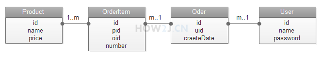
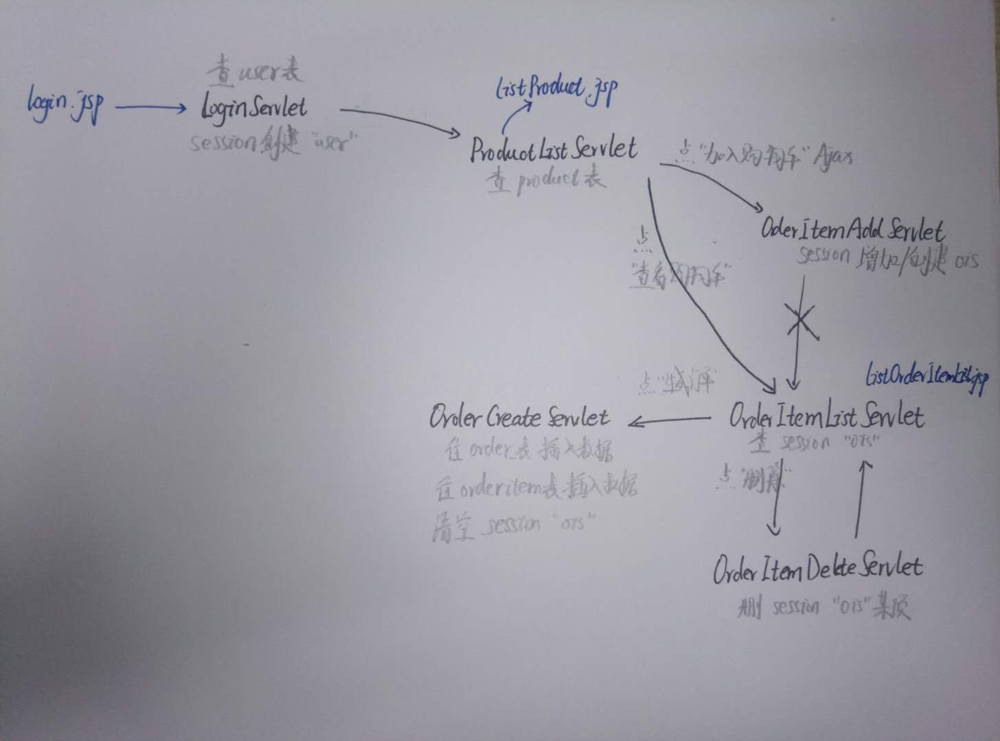

**这个J2EE项目使用了Servlet，Listener，Filter技术，也使用了注解和jdbc技术，应用了MVC的思想，使用的数据库是MySQL。**

数据库表结构：

1. 首先各个类的意义：
   1. Product 产品
   2. User 用户
   3. Order 订单
   4. OrderItem 订单项

2. 表和表之间的关系：

   

网站结构：

做得没有太全面，聊胜于无吧

​	共有三个jsp，分别是login.jsp，listProduct.jsp 和 listOrderItemList.jsp

​	servlet的主要功能都用铅笔写在附近了

改进：

增加注解 src.annotation.JDBCConfig，使得设置连接数据库的参数更方便

将获取数据库连接统一到 src.dao.util.DBUtil 中

增加 src.filter.AuthFilter 和 src.filter.EncodingFilter进行登录验证和中文字体处理

